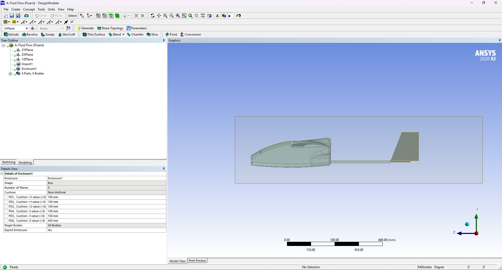
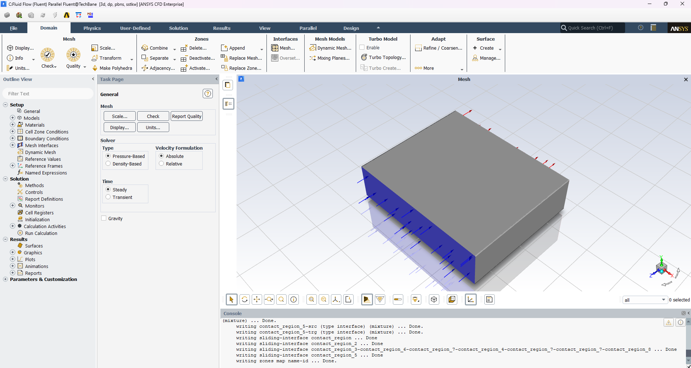
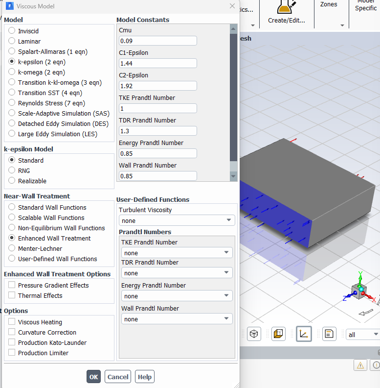
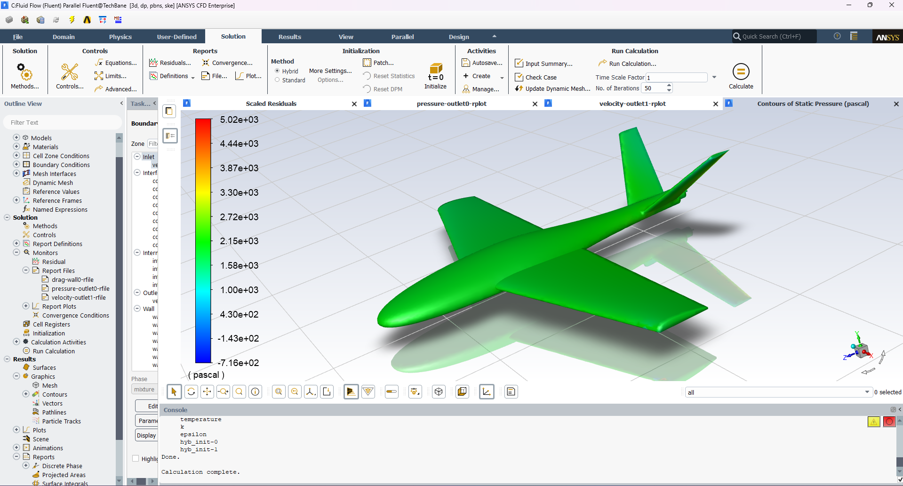
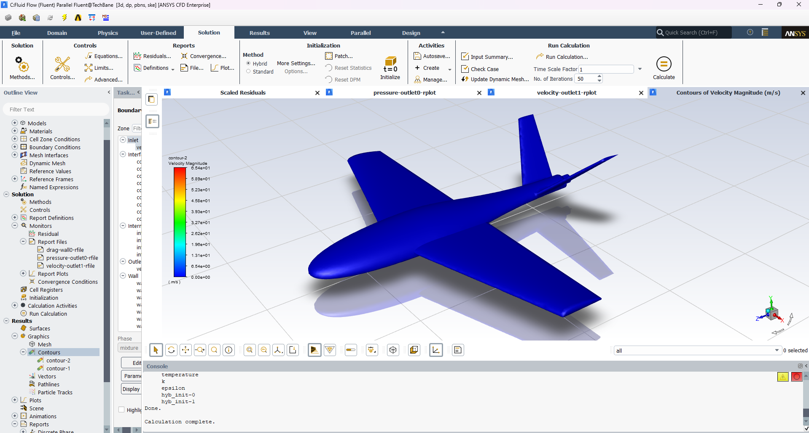
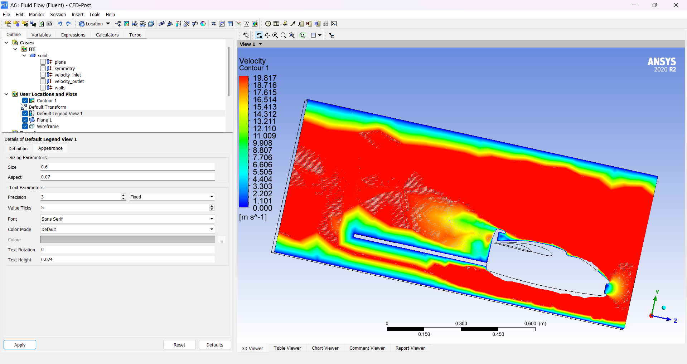
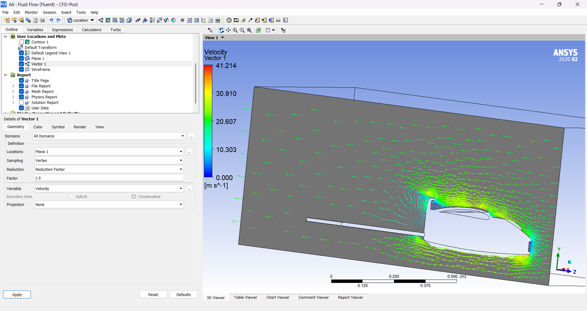
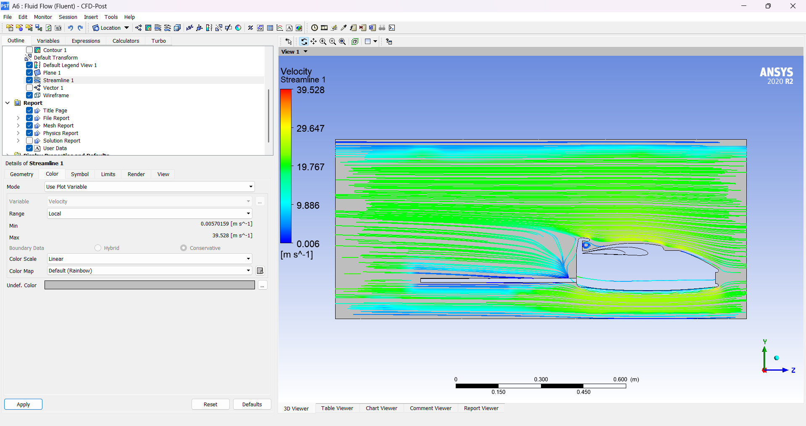

# RC Plane — Aerodynamic Design & CFD Analysis

A fixed-wing RC aircraft designed from scratch in CAD and validated aerodynamically using computational fluid dynamics (CFD) in ANSYS Fluent before being built. This repository contains the full design history: the CAD models, the CFD project files, and the aerodynamic analysis report.

## Overview

The goal of this project was to design an airframe and verify its aerodynamic behaviour analytically before committing to a physical build. Rather than relying on rule-of-thumb sizing alone, the design was pulled into ANSYS and put through a virtual wind tunnel to study how air actually moves over the fuselage, canopy, and wings — checking for flow separation, recirculation, and pressure distribution across the surface.

The workflow was:

1. **Design** the airframe in CAD (SolidWorks), iterating the fuselage/canopy shape and wing planform across several revisions.
2. **Build a CFD model** of each design in ANSYS Workbench — enclosing the aircraft in a virtual wind-tunnel domain, meshing it, and setting up a Fluent simulation.
3. **Run and post-process** the simulation to visualize pressure and velocity fields, check for problem areas (separation around the canopy, stagnation at the nose, etc.), and feed that back into the next design revision.

## Aerodynamic Analysis (CFD) Methodology

Simulations were run in **ANSYS Fluent 2020 R2**, set up through ANSYS Workbench:

- **Domain**: the aircraft geometry was enclosed in a rectangular box (`Enclosure` in DesignModeler) to act as the wind tunnel, with the geometry exported for a clean CFD mesh.
- **Solver**: pressure-based, steady-state, with air as the working fluid.
- **Turbulence modelling**: results were compared across two RANS models — the **standard k-ε model with Enhanced Wall Treatment**, and the **SST k-ω model** — to cross-check near-wall behaviour and flow separation prediction.
- **Boundary conditions**: a velocity-inlet was swept across cruise-relevant speeds (15 m/s and 20 m/s), normal to the boundary, with 5% turbulence intensity and a turbulent viscosity ratio of 10. A pressure-outlet was used downstream, no-slip walls on the airframe surface, and a symmetry plane was used to simulate a half-model and cut solve time.
- **Convergence**: residuals (continuity, velocity components, k, ε) were monitored alongside dedicated report files for drag force and facet-maximum pressure/velocity, run until the solution stabilized.
- **Post-processing**: done in CFD-Post — contour plots of static pressure and velocity magnitude over the full airframe, velocity vector fields, and streamlines through a mid-plane section to visually trace attached vs. separated flow around the nose and canopy.

## Results

| | |
|---|---|
|  |  |
| Aircraft geometry enclosed in the virtual wind-tunnel domain | Meshed CFD domain with inlet/outlet zones defined in Fluent |
|  |  |
| k-ε turbulence model with Enhanced Wall Treatment | Static pressure distribution over the full airframe |
|  |  |
| Velocity magnitude over the full airframe | Cross-section through the canopy showing boundary-layer detail |
|  |  |
| Velocity vectors highlighting local recirculation near the canopy | Streamlines tracing attached vs. separated flow around the nose |

These runs were used to spot where the design was misbehaving aerodynamically (e.g. recirculation pockets around the canopy) and to compare candidate shapes against each other before locking in a final geometry.

## Repository Contents

| Path | Description |
|---|---|
| `Aerodynamic analysis of uav.docx` | Full aerodynamic analysis write-up — CFD setup, solver settings, and result screenshots for each run. |
| `errorless_rcp_abhishekj.step`, `plane_abhiskek_2.step`, `Aircraft Demo.STEP`, `uav+1.stp`, `uav_ansys_abhishek.stp`, `uav_ansys_abhishek_merged.STEP`, `uav2_ansys_pritom.STEP` | CAD geometry exports (STEP) for the airframe across different design iterations. |
| `plane_final_DOORDIE.wbpj`, `mylastbraincell.wbpj`, `plaane2.0.wbpj`, `plane-4-july.wbpj`, `planes_cfd.wbpj` | ANSYS Workbench project files for each CFD study, each paired with a `*_files/` working directory. |
| `rc-plane-model-xps-foam-student-model-1.snapshot.3(.zip)` | Reference XPS-foam RC plane model used as an early baseline/reference geometry. |
| `docs/images/` | Curated screenshots from the CFD runs, embedded above. |

### A note on the `*_files/` folders

Each `.wbpj` file is paired with a same-named `*_files/` directory that ANSYS Workbench uses to store the mesh, solver state, and raw solution data (`.dat.gz`, `.msh`, `.ip`, etc.) for that project. These are regenerated automatically whenever the `.wbpj` is reopened in Workbench, individual solver files run well past 100 MB, and the total across all studies is several hundred MB of binary solver internals — not something meaningful to browse on GitHub. They're excluded from version control via `.gitignore`; the project files (`.wbpj`) and the write-up with result screenshots are kept so the analysis itself is fully documented.

## Tools Used

- **CAD**: SolidWorks (STEP interchange format)
- **CFD**: ANSYS Workbench / Fluent 2020 R2 (DesignModeler for the wind-tunnel enclosure, Fluent for the solve, CFD-Post for post-processing)
